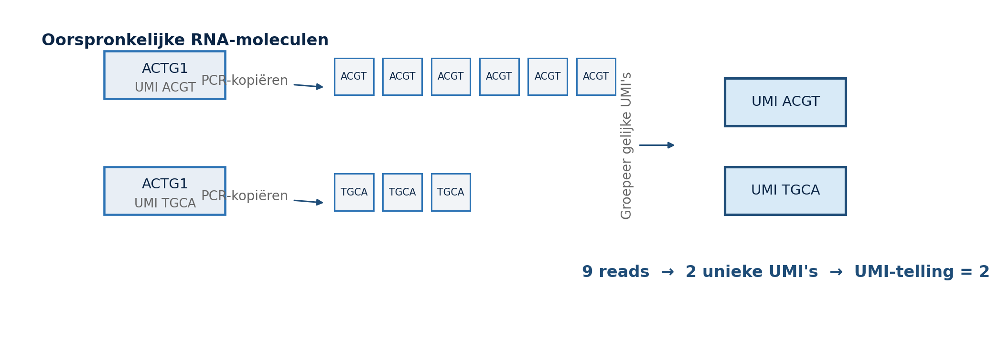
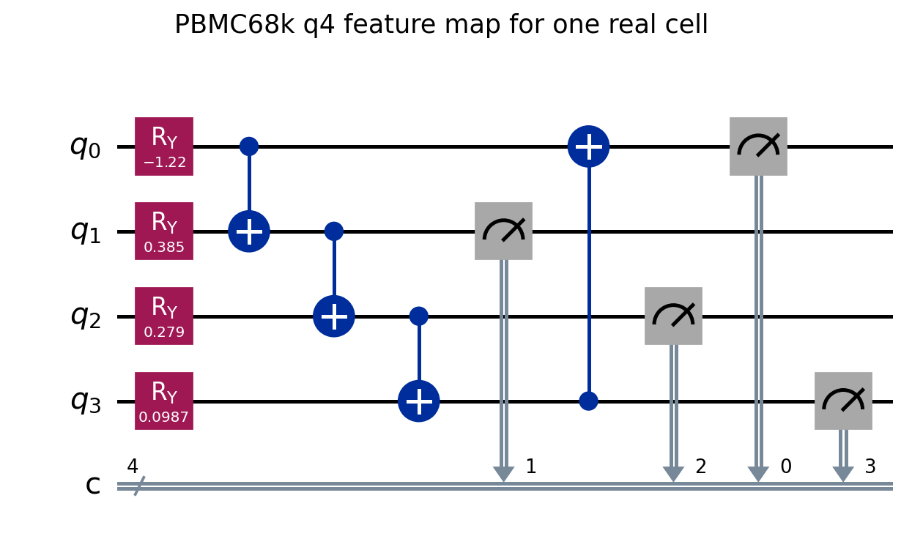
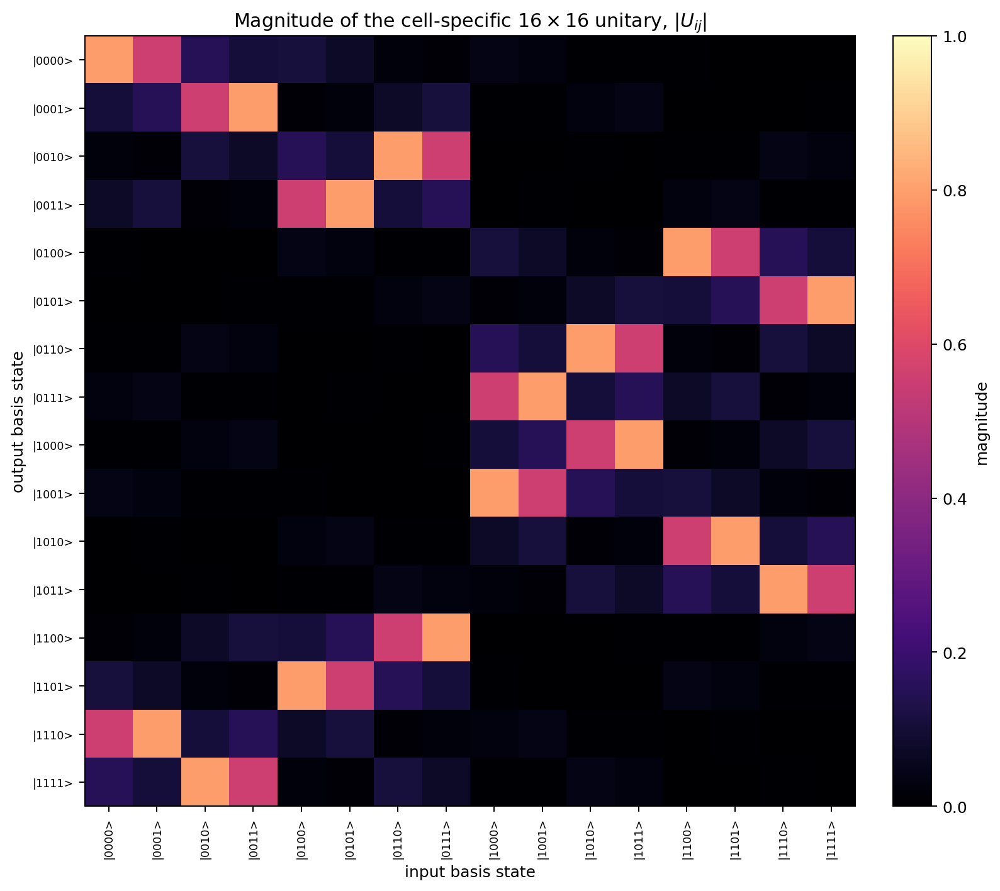
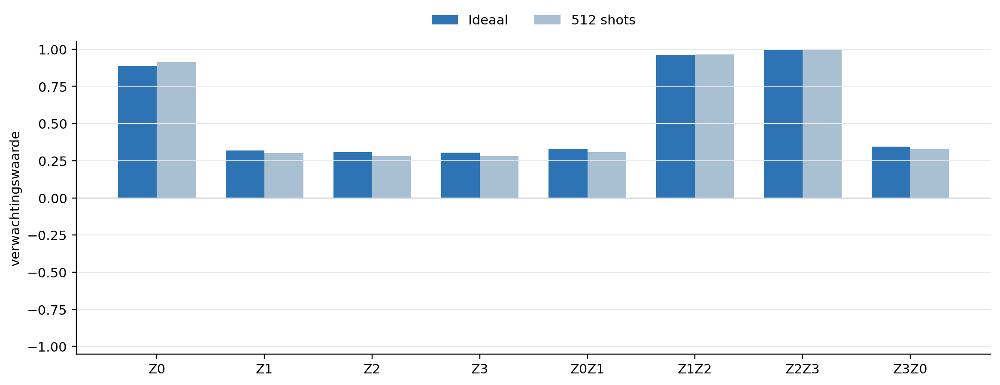

# Van UMI-telling naar een 4-qubit QML-circuit

Dit is een beginnershandleiding voor een kleine maar complete quantum-machine-learningtaak met echte PBMC68k single-cell RNA-data. We volgen één cel vanaf ruwe UMI-tellingen tot rotatiehoeken, een vier-qubitcircuit, acht gemeten quantumfeatures en een klassieke classifier.

De bijbehorende, opgemaakte versie staat in [qml-van-umi-naar-circuit.docx](qml-van-umi-naar-circuit.docx).

De online versie staat als extra hoofdstuk in de [Edukaizen QML-reeks](https://edukaizen.nl/quantum-oracle-sketching-qml-genexpressie/qml-beginnershandleiding-umi-naar-4-qubit-circuit/).

> **Claimgrens:** dit is een educatief vier-qubit simulatormodel. Het reproduceert niet het volledige Quantum Oracle Sketching-algoritme en toont geen quantumvoordeel.

## 1. Wat is de taak?

Eén rij van de countmatrix is één cel. Eén kolom is één gen. De waarde is het aantal onderscheiden RNA-moleculen, benaderd met UMI-tellingen. Het model voorspelt voor iedere cel een van twee labels:

- `CD4+/CD25 T Reg`;
- `CD4+/CD45RO+ Memory`.

De volledige PBMC68k-bron bevat in onze loader 68.579 geannoteerde cellen en 32.738 genen. Het gekozen binaire paar bevat 9.248 cellen. Voor deze uitleg gebruiken we slechts 16 trainingscellen en 16 volledig gescheiden testcellen.

De computer ziet dus niet de naam van een gen als vraag. De taak is:

```text
genexpressieprofiel van een cel -> featuremap -> celtypelabel
```

## 2. Wat telt een UMI?

UMI betekent *Unique Molecular Identifier*. Voor PCR-amplificatie krijgt ieder opgevangen RNA-molecuul een korte barcode. Veel reads met dezelfde celbarcode, genbarcode en UMI zijn waarschijnlijk kopieën van hetzelfde oorspronkelijke molecuul en worden als één molecule geteld.



Een eenvoudig voorbeeld:

```text
9 sequencing reads
|- 5 reads met UMI ACGT
|- 4 reads met UMI TGCA
`- UMI-telling voor dit gen in deze cel = 2
```

De countmatrix bevat dus geen directe continue concentratie. Het is een dunbezette matrix van niet-negatieve gehele tellingen. Een nul kan betekenen dat het gen niet is gedetecteerd; dat is niet hetzelfde als bewezen biologische afwezigheid.

## 3. Eerst splitsen, daarna leren

De vaste seed is 11. Iedere klasse levert acht trainingscellen en acht testcellen. De twee sets overlappen niet.

Alle datagedreven keuzes worden daarna uitsluitend op de trainingscellen gemaakt:

1. de vier genen kiezen;
2. gemiddelde en standaardafwijking leren;
3. het klassieke model trainen;
4. pas daarna eenmaal de zestien testcellen evalueren.

De genselectie gebruikt geen labels. Uit genen met een bruikbare detectiefrequentie worden de vier grootste trainingsvarianties gekozen. Voor deze vaste split zijn dat:

| Qubit | Gen | Detectie in training | Trainingsgemiddelde | Trainingsstandaardafwijking |
| ---: | --- | ---: | ---: | ---: |
| 0 | IER2 | 0,6250 | 1,724827 | 1,482075 |
| 1 | ACTG1 | 0,7500 | 2,261162 | 1,377323 |
| 2 | LIMD2 | 0,5625 | 1,427313 | 1,354013 |
| 3 | GLTSCR2 | 0,7500 | 2,266142 | 1,349629 |

Dit voorkomt twee veelvoorkomende vormen van datalekken: genen kiezen met kennis van testlabels en schaling fitten op testwaarden.

## 4. Van UMI naar rotatiehoek

### 4.1 Bibliotheeknormalisatie

Cellen hebben verschillende totale aantallen UMI's. Voor cel `i` en gen `g` gebruiken we daarom:

$$
n_{ig}=10.000\frac{x_{ig}}{\sum_h x_{ih}},
\qquad
\ell_{ig}=\log(1+n_{ig}).
$$

Hier is $x_{ig}$ de ruwe UMI-telling, $n_{ig}$ de genormaliseerde telling en $\ell_{ig}$ de `log1p`-waarde.

### 4.2 Schalen met alleen trainingdata

Voor ieder geselecteerd gen leren we op de trainingscellen:

$$
z_{ig}=\frac{\ell_{ig}-\mu_g^{\mathrm{train}}}{\sigma_g^{\mathrm{train}}}.
$$

De z-score wordt begrensd tot het interval `[-3,3]` en omgezet naar een rotatiehoek:

$$
\theta_{ig}=\pi\frac{\operatorname{clip}(z_{ig},-3,3)}{3}.
$$

Daardoor ligt iedere hoek in $[-\pi,\pi]$.

### 4.3 Eén echte trainingscel

De eerste cel in de vaste trainingsvolgorde heeft label `CD4+/CD45RO+ Memory`, pair-row 645 en in totaal 2.010 UMI's.

| Gen | Ruwe UMI | `log1p` | z-score | Hoek in radialen |
| --- | ---: | ---: | ---: | ---: |
| IER2 | 0 | 0,000000 | -1,163792 | -1,218720 |
| ACTG1 | 3 | 2,767914 | 0,367925 | 0,385290 |
| LIMD2 | 1 | 1,787605 | 0,266092 | 0,278651 |
| GLTSCR2 | 2 | 2,393362 | 0,094263 | 0,098712 |

De eerste vier trainings- en testcellen zijn als controle beschikbaar in [pbmc68k_q4_data_preview.csv](assets/pbmc68k_q4_data_preview.csv).

## 5. Het quantumcircuit

We beginnen in $|0000\rangle$. Iedere genwaarde bestuurt één `RY`-poort. Daarna verbinden vier CNOT-poorten de qubits in een ring:

$$
0\rightarrow1,\quad1\rightarrow2,\quad2\rightarrow3,\quad3\rightarrow0.
$$



De tekstweergave:

```text
     ┌─────────────┐                   ┌───┐   ┌─┐
q_0: ┤ Ry(-1.2187) ├───■───────────────┤ X ├───┤M├───
     ├─────────────┤ ┌─┴─┐          ┌─┐└─┬─┘   └╥┘
q_1: ┤ Ry(0.38529) ├─┤ X ├──■───────┤M├──┼──────╫────
     ├─────────────┤ └───┘┌─┴─┐     └╥┘  │  ┌─┐ ║
q_2: ┤ Ry(0.27865) ├──────┤ X ├──■───╫───┼──┤M├─╫────
     ├─────────────┴┐     └───┘┌─┴─┐ ║   │  └╥┘ ║ ┌─┐
q_3: ┤ Ry(0.098712) ├──────────┤ X ├─╫───■───╫──╫─┤M├
     └──────────────┘          └───┘ ║       ║  ║ └╥┘
```

Een `RY`-poort heeft matrix

$$
R_Y(\theta)=
\begin{pmatrix}
\cos(\theta/2)&-\sin(\theta/2)\\
\sin(\theta/2)& \cos(\theta/2)
\end{pmatrix}.
$$

Voor vier onafhankelijke rotaties is de eerste laag het tensorproduct

$$
R=R_Y(\theta_3)\otimes R_Y(\theta_2)\otimes
R_Y(\theta_1)\otimes R_Y(\theta_0).
$$

De volledige celafhankelijke unitaire matrix is

$$
U(\theta)=\operatorname{CNOT}_{3\rightarrow0}
\operatorname{CNOT}_{2\rightarrow3}
\operatorname{CNOT}_{1\rightarrow2}
\operatorname{CNOT}_{0\rightarrow1}R.
$$

Omdat vier qubits $2^4=16$ basisstaten hebben, is $U$ een `16 x 16` matrix.



De numerieke controle geeft

$$
\lVert U^\dagger U-I\rVert_F=1{,}11\times10^{-15},
$$

dus de matrix is binnen afrondingsfout unitair. De reële en imaginaire delen staan in [unitary_real.csv](assets/pbmc68k_q4_first_cell_unitary_real.csv) en [unitary_imag.csv](assets/pbmc68k_q4_first_cell_unitary_imag.csv).

## 6. Toestand, kansen en metingen

Voor input $|0000\rangle$ is de uitvoertoestand

$$
|\psi(\theta)\rangle=U(\theta)|0000\rangle
=\sum_{b=0}^{15}a_b|b\rangle.
$$

Volgens de Born-regel is de kans op bitstring $b$

$$
p_b=|a_b|^2,\qquad\sum_b p_b=1.
$$

Voor de voorbeeldcel zijn de grootste ideale kansen:

| Basisstaat `q3q2q1q0` | Kans |
| --- | ---: |
| `0000` | 0,633736 |
| `1110` | 0,308730 |
| `1111` | 0,024114 |
| `1101` | 0,012463 |

De volledige toestandsvector staat in [pbmc68k_q4_first_cell_statevector.csv](assets/pbmc68k_q4_first_cell_statevector.csv). Let op de Qiskit-bitvolgorde: de weergegeven bitstring is `q3 q2 q1 q0`; qubit 0 staat rechts.

## 7. Van bitstrings naar acht quantumfeatures

Voor een gemeten bit $b_q$ gebruiken we de eigenwaarde

$$
z_q=(-1)^{b_q}.
$$

De verwachtingswaarden volgen uit de kansen:

$$
\langle Z_q\rangle=\sum_b p_b(-1)^{b_q},
$$

$$
\langle Z_qZ_r\rangle=\sum_b p_b(-1)^{b_q+b_r}.
$$

De featurevector is

$$
f(x)=(\langle Z_0\rangle,\langle Z_1\rangle,\langle Z_2\rangle,
\langle Z_3\rangle,\langle Z_0Z_1\rangle,\langle Z_1Z_2\rangle,
\langle Z_2Z_3\rangle,\langle Z_3Z_0\rangle).
$$



| Feature | Ideaal | 512 shots |
| --- | ---: | ---: |
| Z0 | 0,886607 | 0,914063 |
| Z1 | 0,319566 | 0,300781 |
| Z2 | 0,307240 | 0,281250 |
| Z3 | 0,305744 | 0,281250 |
| Z0Z1 | 0,329931 | 0,308594 |
| Z1Z2 | 0,961427 | 0,964844 |
| Z2Z3 | 0,995132 | 1,000000 |
| Z3Z0 | 0,344847 | 0,328125 |

Verschillen tussen de twee kolommen zijn gewone shotruis. Meer shots verkleinen gemiddeld de schattingsfout, maar kosten meer circuituitvoeringen.

## 8. De klassieke kop van het hybride model

Het circuit levert acht features per cel. Een klassieke logistische regressie leert vervolgens

$$
P(y=+1\mid f)=\sigma(w^Tf+b),
\qquad
\sigma(a)=\frac{1}{1+e^{-a}}.
$$

De gewichten $w$ en bias $b$ worden klassiek geleerd met de zestien trainingslabels. Het quantumcircuit zelf wordt niet variabel getraind; zijn hoeken komen rechtstreeks uit de celdata.

Op de vaste zestien testcellen geeft deze mini-run:

| Model | Correct | Balanced accuracy |
| --- | ---: | ---: |
| 4q quantumfeatures | 7/16 | 0,4375 |
| Klassiek, dezelfde vier genen | 9/16 | 0,5625 |

Dit is een geslaagde leer- en reproduceerbaarheidsdemonstratie, maar geen prestatievoordeel.

## 9. Zelf uitvoeren

Gebruik vanuit de repository de bestaande Qiskit-omgeving:

```bash
/home/bram/.venvs/qiskit/bin/python \
  qiskit_qos_pbmc68k_q4_educational.py \
  --shots 512 \
  --json-out output/pbmc68k_q4_educational.json
```

Maak daarna de concrete tabellen en afbeeldingen opnieuw:

```bash
/home/bram/.venvs/qiskit/bin/python \
  qiskit_qos_pbmc68k_q4_explain.py \
  --shots 512 \
  --output-dir docs/beginner/assets
```

Bouw de DOCX opnieuw met een Python-omgeving die `python-docx` en `matplotlib` bevat:

```bash
python docs/beginner/build_qml_beginner_doc.py
```

De snelle tests zijn:

```bash
/home/bram/.venvs/qiskit/bin/python -m pytest -q \
  tests/test_qiskit_qos_pbmc68k_q4_educational.py \
  tests/test_qiskit_qos_pbmc68k_q4_explain.py
```

## 10. Is dit Quantum Oracle Sketching?

Niet letterlijk. Dit PBMC68k-beginnersmodel gebruikt vier klassiek voorbereide rotatiehoeken, een vaste CNOT-ring en Z/ZZ-readout. Het is een gewone kleine quantumfeaturemap.

De repository bevat daarnaast een ander vier-qubitexperiment: [qiskit_official_qos_flat_fireopal_pilot.py](../../qiskit_official_qos_flat_fireopal_pilot.py). Dat experiment is wel een letterlijke Qiskit-port van de officiële `q_state_sketch_flat` sampling-kern en is via Fire Opal op IBM Fez uitgevoerd. Ook die flat-QOS-pilot is slechts één bouwsteen en niet het volledige QOS/QSVT-classificatieprotocol.

| Route | Doel | Letterlijke QOS-kern? | Advantageclaim? |
| --- | --- | --- | --- |
| 4q PBMC68k-beginnersmodel | Van UMI-data naar een begrijpelijk circuit en classifier | Nee | Nee |
| 4q flat-QOS-hardwarepilot | Officiële sample-afhankelijke phasesketch testen | Ja, één primitive | Nee |
| 60q PBMC68k-pilot | Brede real-data NISQ-featuremap testen | Nee, QOS-geïnspireerd | Alleen afgebakende lokale timingclaim |

## 11. Bronnen

1. Kivioja et al., *Counting absolute numbers of molecules using unique molecular identifiers*, Nature Methods 9, 72-74 (2012), [doi:10.1038/nmeth.1778](https://doi.org/10.1038/nmeth.1778). Kernfragment: “unique molecular identifiers (UMIs), which make each molecule in the sample distinct.”
2. Zheng et al., *Massively parallel digital transcriptional profiling of single cells*, Nature Communications 8, 14049 (2017), [doi:10.1038/ncomms14049](https://doi.org/10.1038/ncomms14049). Kernfragment: “We profiled 68k peripheral blood mononuclear cells”.
3. [IBM Quantum: RYGate](https://quantum.cloud.ibm.com/docs/en/api/qiskit/qiskit.circuit.library.RYGate), voor de definitie en matrix van de Y-rotatie.
4. [IBM Quantum: Bit ordering](https://quantum.cloud.ibm.com/docs/en/guides/bit-ordering), voor Qiskits qubit- en bitstringconventies.
5. Havlicek et al., *Supervised learning with quantum-enhanced feature spaces*, Nature 567, 209-212 (2019), [doi:10.1038/s41586-019-0980-2](https://doi.org/10.1038/s41586-019-0980-2).
6. Zhao et al., *Exponential quantum advantage in processing massive classical data*, [arXiv:2604.07639](https://arxiv.org/abs/2604.07639), voor Quantum Oracle Sketching en de formele modelgrens.

Brondata:

- [10x Genomics PBMC68k countmatrix](https://cf.10xgenomics.com/samples/cell-exp/1.1.0/fresh_68k_pbmc_donor_a/fresh_68k_pbmc_donor_a_filtered_gene_bc_matrices.tar.gz)
- [PBMC68k celtype-annotaties](https://raw.githubusercontent.com/10XGenomics/single-cell-3prime-paper/master/pbmc68k_analysis/68k_pbmc_barcodes_annotation.tsv)

## Bestanden in dit pakket

- `qiskit_qos_pbmc68k_q4_educational.py`: volledige simulator- en classifierroute;
- `qiskit_qos_pbmc68k_q4_explain.py`: data-, circuit-, matrix- en toestandsartefacten;
- `tests/test_qiskit_qos_pbmc68k_q4_educational.py`: splits, lekkage, features en circuitvorm;
- `tests/test_qiskit_qos_pbmc68k_q4_explain.py`: unitariteit, toestand en exacte features;
- `docs/beginner/build_qml_beginner_doc.py`: reproduceerbare DOCX-builder;
- `docs/beginner/assets/`: de vaste seed-11-voorbeelddata en afbeeldingen.
